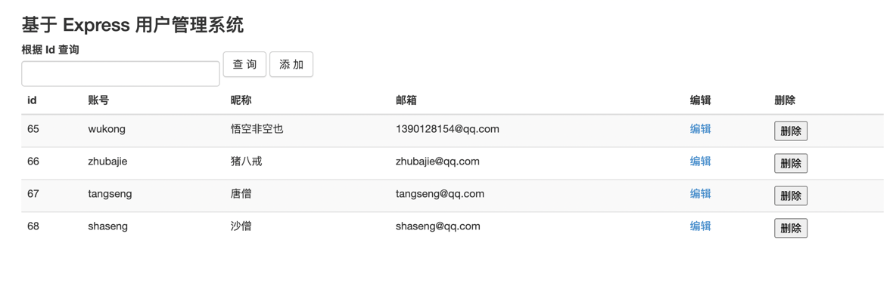

# express-user-crud
基于 Express 的入门级用户管理系统，前端使用 Bootstrap 框架。

## 效果展示图


## 技术介绍
后端：Nodejs、 Express
前端： BootStrap
数据库： mySql 8.x

## 后端 API 接口文档
https://www.apifox.cn/apidoc/shared-44fba203-8cf0-4991-97a5-553b4ed0dc05

## 数据库脚本
```mysql
# 创建库
create database db_cms;

use db_cms;

# 创建表
create table cms_user
(
    avatar       varchar(50)  null,
    id           int auto_increment comment '主键 ID'
        primary key,
    username     varchar(20)  null comment '用户账号',
    password     varchar(100) null comment '用户密码',
    nickname     varchar(20)  null comment '昵称',
    email        varchar(100) null comment '用户邮箱',
    created_by   int          null comment '创建人',
    created_date datetime     null comment '创建时间',
    modify_by    int          null comment '修改人',
    modify_date  datetime     null comment '修改时间',
    role_id      int          null
)
    comment '用户表';


# 插入记录
INSERT INTO db_cms.cms_user (avatar, id, username, password, nickname, email, created_by, created_date, modify_by, modify_date, role_id) VALUES (null, 65, 'wukong', null, '悟空非空也', '1390128154@qq.com', null, null, null, null, null);
INSERT INTO db_cms.cms_user (avatar, id, username, password, nickname, email, created_by, created_date, modify_by, modify_date, role_id) VALUES (null, 66, 'zhubajie', null, '猪八戒', 'zhubajie@qq.com', null, null, null, null, null);
INSERT INTO db_cms.cms_user (avatar, id, username, password, nickname, email, created_by, created_date, modify_by, modify_date, role_id) VALUES (null, 67, 'tangseng', null, '唐僧', 'tangseng@qq.com', null, null, null, null, null);
INSERT INTO db_cms.cms_user (avatar, id, username, password, nickname, email, created_by, created_date, modify_by, modify_date, role_id) VALUES (null, 68, 'shaseng', null, '沙僧', 'shaseng@qq.com', null, null, null, null, null);

```
